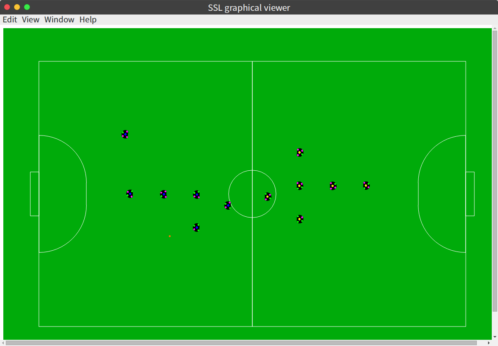

# ssl_graphical_viewer

for robocup ssl  
SSL-Vision or grSim... if you use official packet sending software,
this app enable recieve and view.  

this app using electron.  
so run standalone and cross platform.
if u need run on the server and web viewer

>https://github.com/shuyuhey/ssl_gclient_node

## Download

app downloads

## LICENSE

MIT
