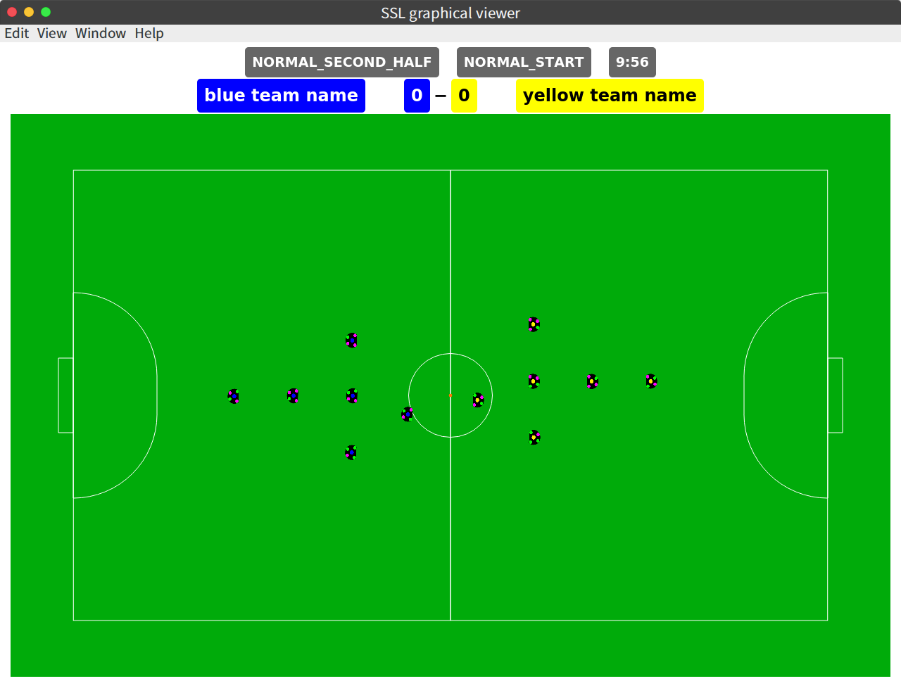

# ssl_graphical_viewer

for robocup ssl  
SSL-Vision or grSim... if you use official packet sending software,
this app enable recieve and view.  



this app using electron.  
so run standalone and cross platform.
if you need run on the server and web viewer

>https://github.com/shuyuhey/ssl_gclient_node

## Download

app downloads v1.1.0

- [Linux(x64)](https://github.com/Tacha-S/ssl_graphical_viewer/releases/download/v1.1.0/ssl_graphical_viewer-linux-x64.zip)
- [Mac(x64)](https://github.com/Tacha-S/ssl_graphical_viewer/releases/download/v1.1.0/ssl_graphical_viewer-darwin-x64.zip)
- [Windows(x64)](https://github.com/Tacha-S/ssl_graphical_viewer/releases/download/v1.1.0/ssl_graphical_viewer-win32-x64.zip)

## Manual Instalation

you need install nodejs and npm and electron.

after installed it

```bash
git clone https://github.com/Tacha-S/ssl_graphical_viewer.git
cd ssl_graphical_viewer
npm install
npm start
```

## Usage

network config (ex. multicast address, port number) in configs/network.json

## LICENSE

MIT
